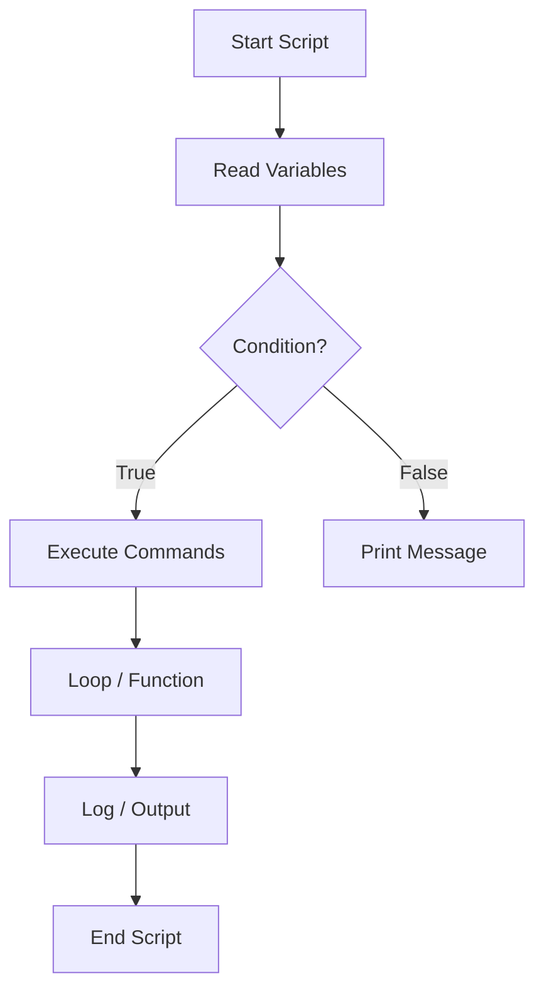

# **Linux Bash Scripting Notes — from Beginner to Advanced**

---

# 🧠 **Linux Bash Scripting — From Beginner to Advanced**

---

## 🐚 1. What is Bash?

**Bash (Bourne Again Shell)** is a Unix shell and command language used for:

* Automating tasks
* Server administration
* DevOps pipelines
* System monitoring / log processing

Check your shell:

```bash
echo $SHELL
bash --version
```

Run a script:

```bash
bash script.sh
# OR make executable
chmod +x script.sh
./script.sh
```

Shebang line (must be first line of every script):

```bash
#!/bin/bash
```

---

## 📘 2. Basic Script Structure

```bash
#!/bin/bash
# My first bash script

echo "Hello, $(whoami)! Today is $(date)."
```

### File permissions

```bash
chmod +x script.sh
./script.sh
```

---

## 🔠 3. Variables

### Declare & use variables

```bash
name="Alice"
echo "Hello $name"
```

### Read input

```bash
read -p "Enter your name: " username
echo "Welcome, $username"
```

### Command substitution

```bash
today=$(date +%A)
echo "Today is $today"
```

### Environment variables

```bash
echo $HOME
echo $PATH
export API_KEY="12345"
```

---

## 🔄 4. Conditional Statements

### If / Else

```bash
#!/bin/bash
num=10

if [ $num -gt 5 ]; then
  echo "Greater than 5"
elif [ $num -eq 5 ]; then
  echo "Equal to 5"
else
  echo "Less than 5"
fi
```

### File tests

| Test      | Meaning      |
| --------- | ------------ |
| `-e file` | Exists       |
| `-f file` | Regular file |
| `-d dir`  | Directory    |
| `-r file` | Readable     |
| `-w file` | Writable     |
| `-x file` | Executable   |
| `-s file` | Not empty    |

```bash
if [ -f "/etc/passwd" ]; then
  echo "File exists"
fi
```

### String tests

```bash
if [ "$a" = "$b" ]; then
  echo "Equal"
fi

if [ -z "$str" ]; then
  echo "Empty string"
fi
```

---

## 🔁 5. Loops

### For loop

```bash
for i in 1 2 3 4 5; do
  echo "Number: $i"
done
```

With range:

```bash
for i in {1..5}; do echo $i; done
```

With command output:

```bash
for user in $(cat /etc/passwd | cut -d: -f1); do
  echo "User: $user"
done
```

### While loop

```bash
count=1
while [ $count -le 5 ]; do
  echo "Count: $count"
  ((count++))
done
```

### Until loop

```bash
x=1
until [ $x -gt 3 ]; do
  echo "x is $x"
  ((x++))
done
```

---

## ⚙️ 6. Case Statement

```bash
read -p "Enter choice (start|stop): " choice

case $choice in
  start)
    echo "Starting service..."
    ;;
  stop)
    echo "Stopping service..."
    ;;
  *)
    echo "Invalid choice"
    ;;
esac
```

---

## 🔢 7. Arithmetic Operations

### Using `expr`

```bash
a=5; b=3
expr $a + $b
```

### Using double parentheses

```bash
a=$((10 + 5))
b=$((a * 2))
echo $b
```

### Increment / Decrement

```bash
((count++))
((count--))
```

---

## 📂 8. Arrays

```bash
fruits=("apple" "banana" "cherry")
echo ${fruits[1]}          # banana
echo ${fruits[@]}          # all elements
echo ${#fruits[@]}         # count

# Add element
fruits+=("mango")
```

Loop through array:

```bash
for fruit in "${fruits[@]}"; do
  echo "Fruit: $fruit"
done
```

---

## 🧩 9. Functions

```bash
function greet() {
  echo "Hello, $1!"
}

greet "Alice"
```

Return value:

```bash
add() {
  return $(( $1 + $2 ))
}
add 5 7
echo $?   # shows 12
```

---

## 📜 10. Command-line Arguments

```bash
#!/bin/bash
echo "Script name: $0"
echo "First arg: $1"
echo "Second arg: $2"
echo "All args: $@"
echo "Count: $#"
```

Example:

```bash
./myscript.sh server1 server2
```

---

## 🧰 11. Input / Output Redirection

| Symbol | Description                   |
| ------ | ----------------------------- |
| `>`    | Redirect stdout (overwrite)   |
| `>>`   | Append                        |
| `<`    | Input                         |
| `2>`   | Redirect stderr               |
| `&>`   | Redirect both stdout + stderr |

```bash
ls > files.txt
ls /notfound 2> errors.log
```

---

## 🧾 12. Piping and Grep

```bash
ps aux | grep nginx
cat /etc/passwd | grep root
```

---

## 🪶 13. String & Text Processing

### Substring

```bash
str="HelloWorld"
echo ${str:0:5}   # Hello
```

### Replace

```bash
echo ${str/World/Bash}  # HelloBash
```

### Length

```bash
echo ${#str}
```

---

## 🕹️ 14. Script Exit & Status

```bash
echo "Running command..."
if command; then
  echo "Success"
else
  echo "Failed"
fi

echo "Exit code: $?"
exit 0
```

---

## 🧱 15. File Handling Example

```bash
#!/bin/bash
read -p "Enter filename: " file

if [ -f "$file" ]; then
  echo "File found!"
  cat "$file"
else
  echo "File not found!"
fi
```

---

## ⚠️ 16. Error Handling & Debugging

### Debug mode

```bash
bash -x script.sh
```

### Within script

```bash
set -x    # turn on debug
set +x    # turn off debug
set -e    # exit on error
```

### Trap signals

```bash
trap "echo 'Script interrupted'; exit" SIGINT SIGTERM
```

---

## 🧮 17. Logging

```bash
LOGFILE="/var/log/myscript.log"
echo "$(date) - Script started" >> $LOGFILE
```

---

## 🧰 18. Cron Jobs (Automation)

Edit crontab:

```bash
crontab -e
```

Example entries:

```
0 * * * * /home/user/backup.sh
@daily /home/user/cleanup.sh
```

List:

```bash
crontab -l
```

---

## 🧬 19. Advanced Topics

### Regex with `[[ ]]`

```bash
word="hello123"
if [[ $word =~ ^[a-z]+[0-9]+$ ]]; then
  echo "Matched pattern"
fi
```

### Command substitution chain

```bash
files=$(ls | wc -l)
echo "Total files: $files"
```

### Color output

```bash
RED='\033[0;31m'
NC='\033[0m'
echo -e "${RED}Error occurred${NC}"
```

### Parallel execution

```bash
(command1 &) && (command2 &)
wait
```

---

## 🧠 20. Practical Mini Projects

✅ **Check service status**

```bash
#!/bin/bash
service="nginx"
if systemctl is-active --quiet $service; then
  echo "$service is running"
else
  echo "$service is stopped"
fi
```

✅ **Ping Monitor**

```bash
#!/bin/bash
for host in google.com 8.8.8.8; do
  ping -c1 $host &> /dev/null && echo "$host UP" || echo "$host DOWN"
done
```

✅ **Log backup**

```bash
#!/bin/bash
tar -czf /backup/logs_$(date +%F).tar.gz /var/log/*
```

---

## 🧩 21. Mermaid Diagram — Script Flow



---

## ⚡ 22. Interview Quick Q&A

> **Q:** How do you handle errors in Bash?
> **A:** Use `set -e` to stop on error or check `$?`. Combine with `trap` for clean exit.

> **Q:** Difference between `>` and `>>`?
> **A:** `>` overwrites file; `>>` appends.

> **Q:** How to pass arguments to a script?
> **A:** Via `$1`, `$2`, `$@`.

> **Q:** How to check if a directory exists?
> **A:** `[ -d "/path" ] && echo "exists"`

> **Q:** What does `#!/bin/bash` mean?
> **A:** It tells OS to use bash interpreter.

> **Q:** How to debug bash scripts?
> **A:** `bash -x script.sh` or use `set -x` inside.

---

## 🧩 23. Cheatsheet Summary

| Task                   | Command                         |
| ---------------------- | ------------------------------- |
| Make script executable | `chmod +x script.sh`            |
| Execute script         | `./script.sh`                   |
| Print variable         | `echo $var`                     |
| Arithmetic             | `$((a+b))`                      |
| If condition           | `if [ cond ]; then ... fi`      |
| For loop               | `for i in {1..5}; do ...; done` |
| Function               | `func() { ... }`                |
| Debug                  | `bash -x script.sh`             |
| Redirect output        | `cmd > file`                    |
| Append output          | `cmd >> file`                   |
| Run in background      | `cmd &`                         |

---
