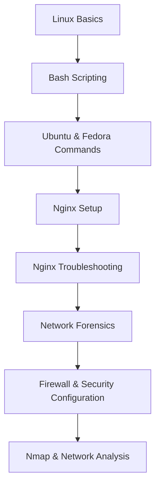

# 🧭 **Linux & Nginx — Master Notes Index (Beginner → Advanced)**

| Level               | Category                              | Topic / Description                                                                                                                     | Link                                                                                                                                                                             |
| :------------------ | :------------------------------------ | :-------------------------------------------------------------------------------------------------------------------------------------- | :------------------------------------------------------------------------------------------------------------------------------------------------------------------------------- |
| 🟢 **Beginner**     | **Linux Basics**                      | 🔹 **Linux File Permissions** – Explanation of `rwx`, `chmod`, `chown`, `umask`, symbolic and numeric modes with examples and diagrams. | [View Notes](https://github.com/akashdip2001/linux-all-commands/blob/main/00%20Linux%20File%20Permission.md)                                                                     |
| 🟢 **Beginner**     | **Shell Scripting**                   | 🔹 **Bash Scripting Basics** – Variables, loops, conditionals, functions, I/O redirection, and automation fundamentals.                 | [View Notes](https://github.com/akashdip2001/linux-all-commands/blob/main/01%20Bash%20Scripting.md)                                                                              |
| 🟢 **Beginner**     | **Linux Commands Collection**         | 🔹 **Kali Linux All Commands** – Essential Kali commands for penetration testing, system checks, and network tools.                     | [View Notes](https://akashdip2001.github.io/kali-all-commands/#my-website-https-akashdip2001-github-io-linktree)                                                                 |
| | | 🔹 Ubuntu Commands Reference | [View](https://akashdip2001.github.io/ubuntu-all-commaands/) |
| | | 🔹 Fedora Commands Reference | [View](https://akashdip2001.github.io/fedora-all-imp-commands/) |
| 🟡 **Intermediate** | **Web Server Setup**                  | 🔹 **Nginx Setup & Configuration** – Step-by-step guide for installing and configuring Nginx, directory structure, and virtual hosts.   | [View Notes](https://github.com/akashdip2001/Nginx-Comprehensive-Notes-Troubleshooting-Configs-Diagrams-Scripts/blob/main/00%20setup%20Nginx.md)                                 |
| 🟠 **Advanced**     | **Network Troubleshooting**           | 🔹 **Nginx Troubleshooting Guide** – Diagnosing connection issues, DNS, reverse proxy problems, and HTTP response code analysis.        | [View Notes](https://github.com/akashdip2001/Nginx-Comprehensive-Notes-Troubleshooting-Configs-Diagrams-Scripts/blob/main/01%20Nginx%20Troubleshooting.md)                       |
| 🟠 **Advanced**     | **Network Forensics**                 | 🔹 **Network Forensics & Packet Analysis** – Using tools like Wireshark, tcpdump, and analyzing ICMP, HTTP, and TCP behavior.           | [View Notes](https://github.com/akashdip2001/Nginx-Comprehensive-Notes-Troubleshooting-Configs-Diagrams-Scripts/blob/main/02%20Network%20Forensics%20%26%20Packet%20Analysis.md) |
| 🔴 **Expert**       | **Nmap & Security Analysis**          | 🔹 **IP Not Found in Nmap** – Steps to troubleshoot unreachable IPs, ICMP filters, firewall rules, routing, and port scans.             | [View Notes](https://github.com/akashdip2001/Nginx-Comprehensive-Notes-Troubleshooting-Configs-Diagrams-Scripts/blob/main/03%20IP%20not%20found%20nMap.md)                       |
| 🔴 **Expert**       | **Firewall & Security Configuration** | 🔹 **Allow Firewall Rules for Nginx** – Configure UFW, firewalld, iptables to allow ports and IP-specific access in Linux or cloud.     | [View Notes](https://github.com/akashdip2001/Nginx-Comprehensive-Notes-Troubleshooting-Configs-Diagrams-Scripts/blob/main/04%20allow%20Firewall.md)                              |

---

### 🧩 **Progress Flow (Mermaid Diagram)**



</br>
</br>


```html
<section class="u-clearfix u-gradient u-section-1" id="carousel_aeea">
      <div class="u-clearfix u-sheet u-sheet-1">
        <div
          class="u-clearfix u-expanded-width-md u-expanded-width-xl u-gutter-26 u-layout-wrap u-layout-wrap-1"
        >
          <div class="u-layout">
            <div class="u-layout-row">
              <div class="u-size-20">
                <div class="u-layout-col">
                  <div
                    class="u-container-style u-image u-layout-cell u-size-60 u-image-1"
                    data-image-width="241"
                    data-image-height="305"
                    data-href="https://akashdip2001.github.io/kali-all-commands/#my-website-https-akashdip2001-github-io-linktree"
                    data-target="_blank"
                  >
                    <div class="u-container-layout u-container-layout-1"></div>
                  </div>
                </div>
              </div>
              <div class="u-size-20">
                <div class="u-layout-col">
                  <div
                    class="u-container-style u-layout-cell u-size-60 u-layout-cell-2"
                    data-href="https://akashdip2001.github.io/linktree/"
                    data-target="_blank"
                  >
                    <div
                      class="u-container-layout u-valign-middle-md u-container-layout-2"
                    >
                      
                    </div>
                  </div>
                </div>
              </div>
              <div class="u-size-20">
                <div class="u-layout-col">
                  <div
                    class="u-container-style u-layout-cell u-size-60 u-layout-cell-3"
                    data-href="https://akashdip2001.github.io/linktree/"
                    data-target="_blank"
                  >
                    <div class="u-container-layout u-container-layout-3">
                      
                    </div>
                  </div>
                </div>
              </div>
            </div>
          </div>
        </div>
      </div>
    </section>
```
